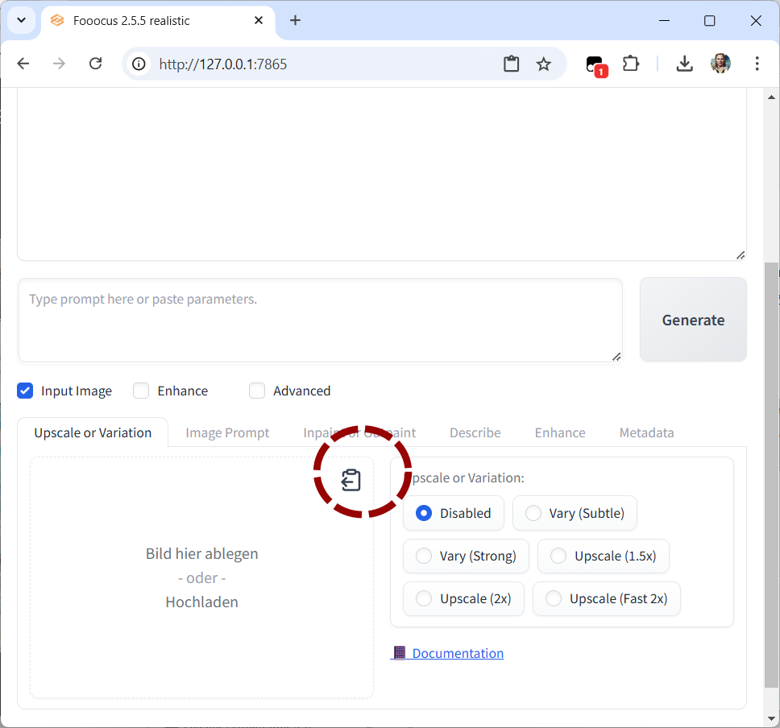

# Foocus Paster

**Foocus Paster** is a Tampermonkey userscript that adds a convenient "Paste Image" button to all image upload fields in the [Foocus]([https://foocus.app](https://github.com/lllyasviel/Fooocus)) application. This feature allows users to directly paste images from the clipboard into Foocus, streamlining the process of uploading images.



## Features

- Adds a "Paste Image" button to each image upload field in Foocus.
- Automatically checks the clipboard for supported image types (`image/png`, `image/jpeg`, `image/gif`) and enables or disables the paste button accordingly.
- Provides a helpful alert if the clipboard content is not a valid image format.
- Works with multiple Foocus applications based on Svelte for image handling.

## How It Works

When the page loads, the script searches for image upload containers and adds a paste button to each. When clicked, the button reads from the clipboard, verifies if an image is available, and uploads it to the Foocus application. The button is enabled or disabled based on clipboard content, making it easy to understand when an image is available to paste.

## Installation

1. **Install Tampermonkey**  
   Make sure you have the [Tampermonkey extension](https://www.tampermonkey.net/) installed in your browser.

2. **Add the Script**  
   Create a new userscript in Tampermonkey and copy the code from `foocus-paster.user.js` (found in this repository) into the editor.

3. **Save and Enable the Script**  
   Save the script and make sure it is enabled in Tampermonkey.

4. **Access Foocus**  
   Open [Foocus](http://127.0.0.1:7865) (or another supported local URL) in your browser, and you should see the paste button in each image upload field.

## Usage

1. **Copy an Image to Clipboard**  
   Copy an image from any source to your clipboard (e.g., from a website, screenshot, etc.).

2. **Click the Paste Button**  
   In Foocus, locate the image upload field, then click the "Paste Image" button added by this script.

3. **Image Pasting**  
   The image will be uploaded to the Foocus image input field. If the clipboard does not contain a supported image type, an alert will notify you.

## Supported Image Formats

- `PNG`
- `JPEG`
- `GIF`

## Script Details

This script is built for Foocus applications that use Svelte for image handling. It should theoretically work with other similar applications as well.

### Code Overview

```javascript
// ==UserScript==
// @name         Foocus Paster
// @namespace    http://tampermonkey.net/
// @version      2024-10-31
// @description  Adds clipboard paste buttons to Foocus upload fields
// @match        http://127.0.0.1:7865*
// @grant        none
// ==/UserScript==
This script targets the local Foocus application at http://127.0.0.1:7865 and is designed to work with various image handling elements based on the Svelte framework.

### Clipboard Detection
The script dynamically checks if an image is available in the clipboard. The button is only enabled if a supported image format is found. Otherwise, it displays a disabled state with a tooltip indicating that no valid image is in the clipboard.

### Additional Notes
The script includes error handling for clipboard access.
The script dynamically updates the button state when the clipboard content changes.
### Troubleshooting
No Image Detected: Ensure that the image is copied to the clipboard in a supported format.
Clipboard Access Error: Some browsers may restrict clipboard access due to security settings. Ensure clipboard permissions are enabled for this application.
### Contributing
Feel free to open issues or submit pull requests to improve functionality or compatibility with other Svelte-based applications.

### License
This work is licensed under a Creative Commons Attribution 4.0 International License (CC BY 4.0).

By using this license, you are free to:

Share — copy and redistribute the material in any medium or format
Adapt — remix, transform, and build upon the material for any purpose, even commercially.
Attribution: You must give appropriate credit, provide a link to the license, and indicate if changes were made. You may do so in any reasonable manner, but not in any way that suggests the author endorses you or your use.

Enjoy a smoother image upload experience with Foocus Paster!


